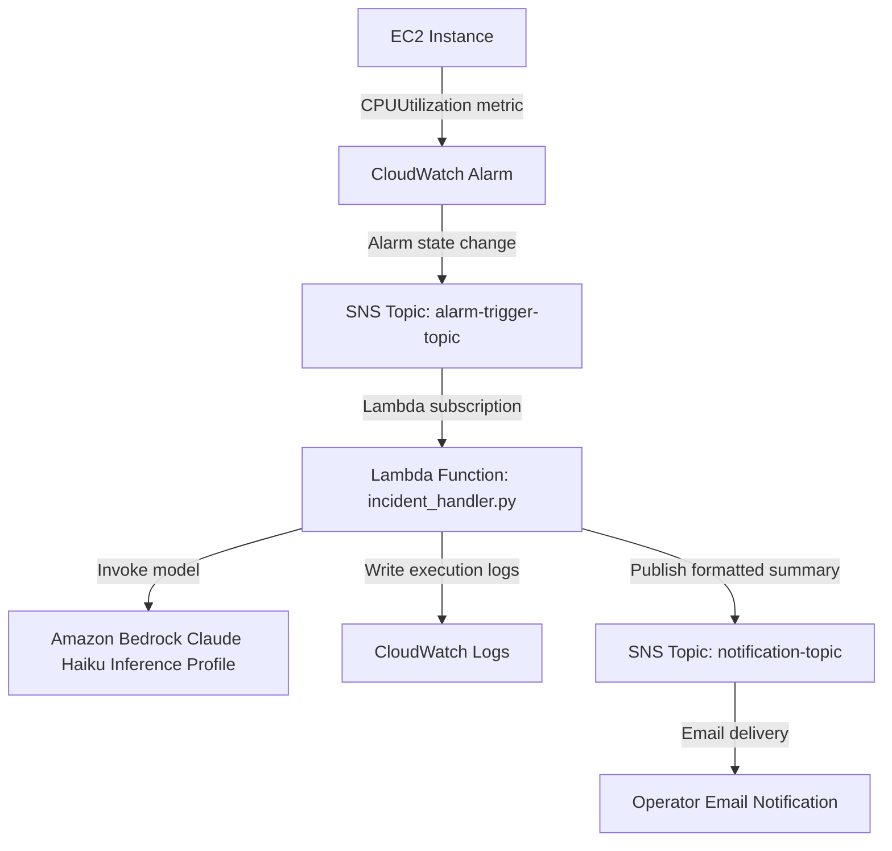
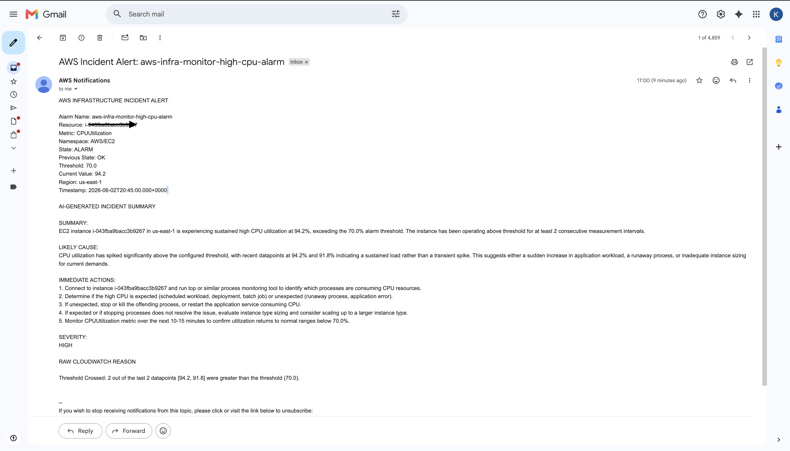

# AWS AI-Powered Infrastructure Monitor

An AWS infrastructure monitoring project that detects EC2 CPU threshold breaches, processes CloudWatch alarm context with AWS Lambda, generates an AI incident summary using Amazon Bedrock, and sends email notifications through Amazon SNS.

## Quick Start

1. Clone the repository:

```bash
git clone https://github.com/krishna310301/aws-infra-monitor.git
cd aws-infra-monitor
```

2. Copy the example Terraform variables file:

```bash
cp terraform.tfvars.example terraform.tfvars
```

3. Update `terraform.tfvars` with your AWS region, notification email, instance type, CPU threshold, and Bedrock inference profile ID.

4. Initialize Terraform:

```bash
terraform init
```

5. Review the infrastructure plan:

```bash
terraform plan
```

6. Deploy the infrastructure:

```bash
terraform apply
```

7. Confirm the SNS subscription email sent by AWS.

8. Test the workflow using the sample CloudWatch alarm payload:

```bash
aws sns publish \
  --topic-arn <alarm-trigger-topic-arn> \
  --message file://test-alarm.json \
  --region us-east-1
```

9. Verify Lambda execution in CloudWatch Logs:

```bash
aws logs tail /aws/lambda/aws-infra-monitor-incident-handler --region us-east-1 --since 10m
```

## Architecture



## Tech Stack

- AWS EC2
- Amazon CloudWatch
- Amazon SNS
- AWS Lambda
- Amazon Bedrock
- Terraform
- Python
- GitHub Actions

## Key Features

- Provisioned AWS infrastructure using Terraform
- Monitored EC2 CPU utilization with CloudWatch alarms
- Used separate SNS topics for alarm triggering and email notification
- Built a Lambda function to parse CloudWatch alarm payloads
- Integrated Amazon Bedrock using a Claude Haiku inference profile
- Generated AI incident summaries, likely causes, recommended actions, and severity
- Added fallback handling when AI generation fails
- Scoped Bedrock IAM permissions to the configured inference profile and foundation model
- Enforced IMDSv2 on the monitored EC2 instance
- Added GitHub Actions workflow for Terraform validation

## Bedrock Model / Inference Profile

The Lambda function uses the following Bedrock inference profile through the `BEDROCK_MODEL_ID` environment variable:

```text
us.anthropic.claude-haiku-4-5-20251001-v1:0
```

## Demo Screenshot

The system sends an AI-generated incident summary email after the test CloudWatch alarm payload is published to the alarm trigger SNS topic.



## Validation Evidence

The project was validated with:

- Terraform state/output showing provisioned resources
- SNS email subscription confirmation
- Manual SNS test publish with MessageId
- AI-generated incident email notification
- CloudWatch Logs confirming successful Lambda execution
- GitHub Actions Terraform validation workflow

## Example Incident Output

```text
SUMMARY:
EC2 instance i-xxxxxxxxxxxxxxxxx is experiencing sustained high CPU utilization, exceeding the configured alarm threshold.

LIKELY CAUSE:
Recent datapoints indicate sustained CPU load rather than a transient spike. This may be caused by increased application workload, a runaway process, or inadequate instance sizing.

IMMEDIATE ACTIONS:
1. Connect to the instance and inspect CPU-consuming processes.
2. Determine whether the workload is expected or unexpected.
3. Restart or stop the offending process if required.
4. Evaluate instance sizing if the load is expected.
5. Continue monitoring CloudWatch metrics.

SEVERITY:
HIGH
```

## CI/CD

This repository includes a GitHub Actions workflow that runs:

```bash
terraform fmt -check
terraform init -backend=false
terraform validate
```

## Security Notes

- Terraform state files and local variable files are excluded from version control.
- The Lambda IAM role uses scoped permissions for CloudWatch Logs, SNS publishing, and Bedrock model invocation.
- Bedrock invocation is scoped to the configured inference profile and foundation model.
- AWS Marketplace read/subscribe permissions are included because Anthropic Bedrock models may require Marketplace-backed access activation in some AWS accounts.
- IMDSv2 is enforced on the EC2 instance using `http_tokens = "required"`.
- Screenshots and local validation evidence are not committed unless sanitized for public display.

## Future Improvements

- Add Systems Manager Session Manager support for secure EC2 access
- Add automated CPU stress test script
- Add Slack or Microsoft Teams notification integration
- Store incident history in DynamoDB
- Add EventBridge routing for multi-alarm workflows
- Further restrict Bedrock permissions using organization-specific service control policies
